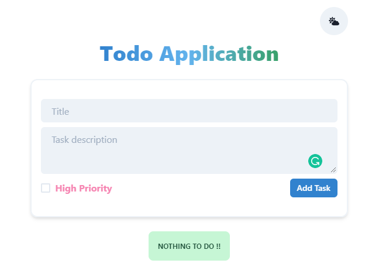
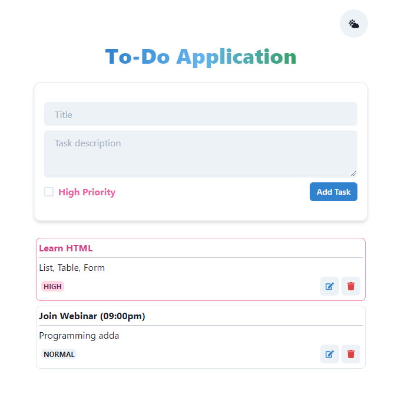
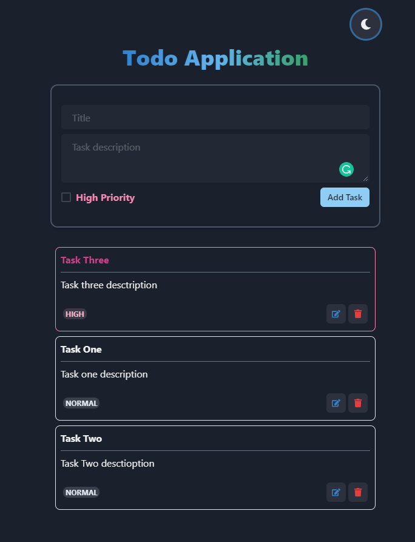
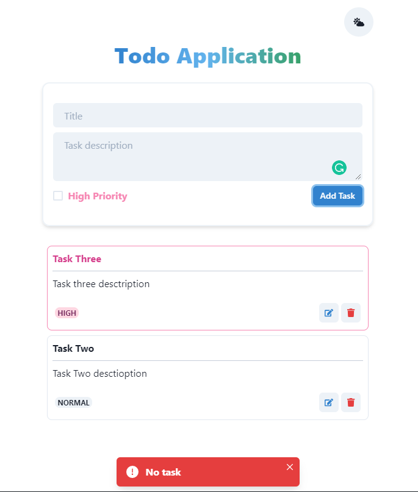

### Todo Application

```
npm install
npm start
```

### Tools:

- [React](https://reactjs.org/)
- [ChakraUI](https://chakra-ui.com/)

### Features:

- Add task.
- Add with priority.
- Sort with priority.
- Remove task.
- Edit and update.
- Show toast message if the user tries to add an empty title.
- Show message if there has not no task to do.
- Local Storage.
- Dark Mode.
- Responsive.

### Screenshot:

All task are done! <br/>


Add task. <br/>


Dark mode! <br/>


Edit and update task. <br/>

